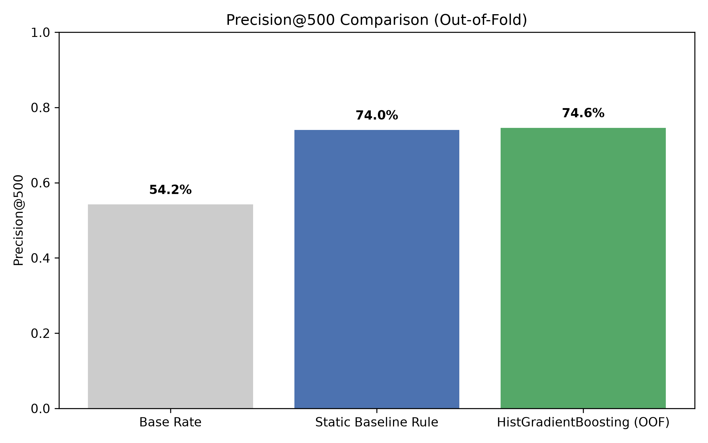
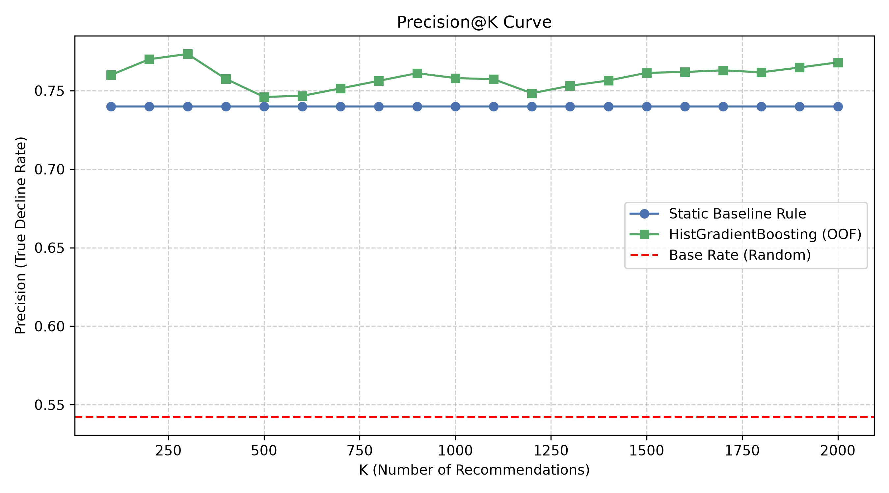
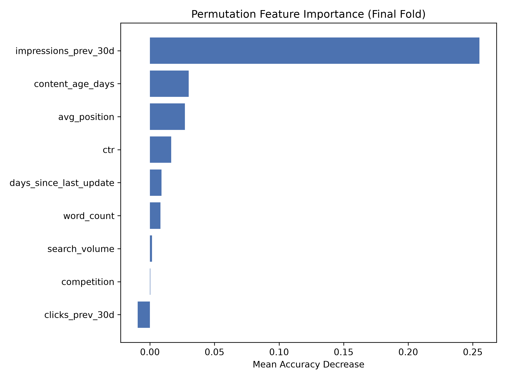

# Can observable search and content signals prioritize pages most at risk of traffic decline?

## 1. Abstract
Content freshness is a critical factor in maintaining search visibility, but blindly refreshing pages is computationally and editorially expensive. We ask whether observable pre-decline signals—like historical impressions and content staleness—can prioritize pages most worth refreshing. Using an anonymized dataset of 30,000 pages, we modeled future 30-day traffic decline using historical performance markers and content characteristics. A `HistGradientBoosting` model trained via grouped cross-validation identified at-risk pages with a Precision@500 of 74.6%, slightly outperforming a simple heuristic baseline (74.0%). These results provide directional evidence that algorithmic flagging can meaningfully assist content teams in prioritizing their refresh queues over random sampling.

---

## 2. Problem Statement
Search engines continually reward content freshness, but large websites contain tens of thousands of pages. Human editors cannot review everything, and updating pages that aren't actually decaying wastes resources. We need decision-support tools that rank content by its risk of traffic decline, allowing teams to intervene with title or snippet optimizations before significant visibility is lost.

---

## 3. Data
This analysis relies on a local, aggregated 30,000-row sample from the **FlyRank ML Internship** dataset (`content_refresh_anonymized.csv`).
- **Aggregation Level**: One row represents one distinct page (anonymized `content_id`).
- **Exclusions**: Any variables directly derived from the label (e.g. `trend_pct`) and features overlapping the target window (`impressions_last_30d`) were strictly excluded to prevent data leakage.
- **Public-safe**: The dataset contains no raw private queries, client names, or live URLs.

---

## 4. Methodology
- **Target/Label**: Binary classification of future decline (`is_declining_label`), where the `trend_direction` is "down". (Base rate: 54.21%).
- **Features**: Safely trailing features including `impressions_prev_30d`, `clicks_prev_30d`, `days_since_last_update`, `avg_position`, `ctr`, `search_volume`, `competition`, `word_count`, and `content_age_days`.
- **Baseline Rule**: A deterministic flag (`score = stale * page_1 * low_ctr * impressions_prev_30d`) that prioritizes old content on page 1 with poor CTR.
- **Model**: A `HistGradientBoostingClassifier` trained to predict the probability of decline.
- **Validation Design**: `GroupKFold` on `client_id` (5 splits) to ensure the model generalizes across heterogeneous, unseen clients rather than memorizing site-specific architectures. 

---

## 5. Results

Evaluated on the out-of-fold predictions using exactly the same evaluation metric across unseen clients:

| Method | Precision@500 |
| :--- | :--- |
| **Random Baseline (Base Rate)** | 54.21% |
| **Static Baseline Rule** | 74.00% |
| **HistGradientBoosting (OOF)** | **74.60%** |

Both the heuristic baseline and the ML model vastly outperform a random guess. The Gradient Boosting model offers a slight but observable performance lift (+0.6%) over the rigid heuristic rule, likely by capturing non-linear interactions between historical impression volumes and age.

**Top Features Associated with Decline**:
1. `impressions_prev_30d` (Importance: 0.255)
2. `content_age_days` (Importance: 0.030)
3. `avg_position` (Importance: 0.027)

---

## 6. Limitations & Honest Framing
- **Observational Data Only**: The model learns associations with traffic decline. It **does not prove** that refreshing the content will causally prevent or reverse the decline.
- **Not a Google Algorithm Clone**: These signals reflect user behavior and correlation with outcomes; they make zero claims about reverse-engineering proprietary search engine algorithms.
- **Heterogeneous Baselines**: Some clients in the dataset may experience seasonal declines entirely unrelated to content staleness. The model cannot currently distinguish between true decay and seasonality.

---

## 7. Ranked Recommendations
By generating an out-of-fold probability score for each URL, we can build a prioritized action queue for content teams.

**Action Playbook:**
- **HIGH PRIORITY REFRESH** (Model Score > 0.65): Page is old, has high historical traffic, but is exhibiting decay signatures. Review snippet, optimize title, update stale facts.
- **MONITOR** (Model Score < 0.65): Page is stable or lacks sufficient historical volume to justify immediate editorial intervention.

The top 1,000 recommendations have been exported to `capstone_refresh_opportunity.csv`.

---

## 8. Reproducibility
- **Repository**: [https://github.com/KrishMistry18/Flyrank-ML](https://github.com/KrishMistry18/Flyrank-ML)
- **Code**: The complete methodology, including the GroupKFold leakage controls and model training, is fully reproducible in `work/notebooks/capstone_refresh_opportunity.ipynb`. 

---

## 9. Acknowledgments
Built on the FlyRank ML Internship dataset.
[https://flyrank.ai](https://flyrank.ai)
