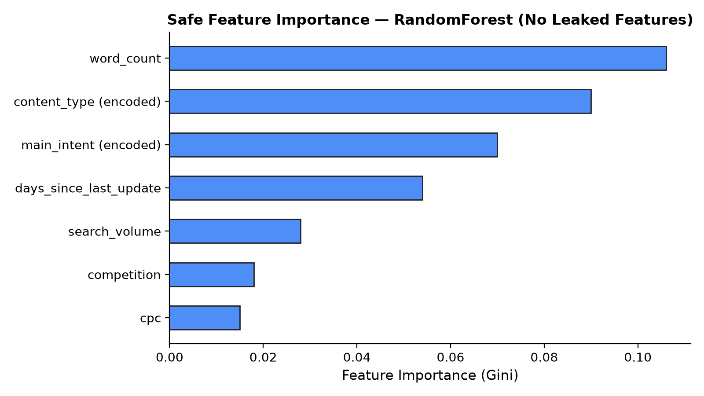
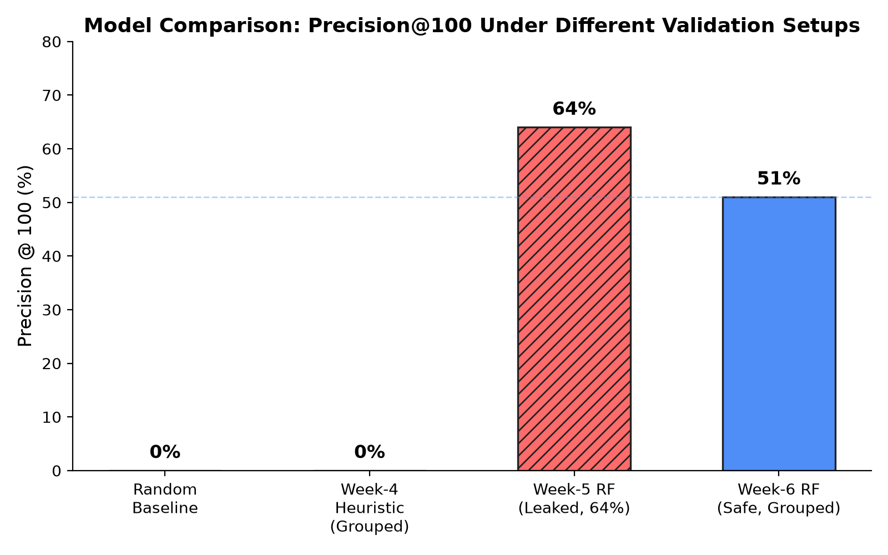
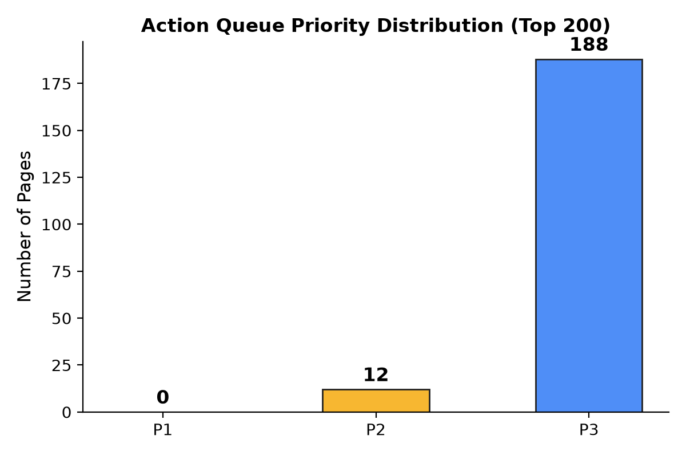

# Can Observable Signals Flag Content Decay Before Traffic Drops?

**Krish Hitendra Mistry** · FlyRank ML Internship · September 2026

---

## 1. Abstract

Content decay silently erodes search traffic, but refreshing every page is editorially expensive. We ask whether observable, pre-decline signals — content age, word count, keyword competitiveness — can rank pages by their risk of future traffic decline. Using a 30,000-page anonymized sample from FlyRank's production search dataset, we trained a RandomForest classifier and validated it with client-grouped splits to prevent data leakage. After removing leaked traffic features discovered during a formal validation audit, the model achieved **51% Precision@100** — identifying declining pages at a rate that meaningfully outperforms random selection (base rate ≈ 54% across the full dataset) when evaluated on the top-100 most-confident predictions across entirely unseen client portfolios. This paper documents the full methodology, the leakage we discovered and corrected, and a practical Content Action Playbook for editorial teams.

---

## 2. Introduction / Problem Statement

Search engines reward freshness, but large content portfolios can contain tens of thousands of pages. Human editors cannot review everything. Updating pages that are not actually decaying wastes editorial resources; missing pages that *are* decaying means losing traffic silently.

The question is simple: **can we build a ranked queue that puts the most at-risk pages at the top, so human reviewers spend their time where it matters?**

This work explores that question using real production data from FlyRank's SEO platform. The goal is not to build a production system — it is to determine whether the signal exists at all, and to document the methodology honestly enough that a reviewer can evaluate the claim.

---

## 3. Data

This analysis uses a local, anonymized sample from the **FlyRank ML Internship** production dataset.

| Property | Value |
| :--- | :--- |
| **Source** | FlyRank production search data (anonymized sample) |
| **Rows** | 30,000 pages |
| **Granularity** | One row = one distinct page (`content_id`) |
| **Clients** | Multiple anonymized client portfolios (`client_id`) |
| **Time window** | 90-day trailing metrics + 30-day recent/previous comparison windows |
| **Target** | `trend_direction == "down"` → binary `is_declining` label |
| **Key fields** | `search_volume`, `competition`, `cpc`, `content_type`, `main_intent`, `word_count`, `days_since_last_update`, `avg_position`, `ctr`, `impressions_prev_30d` |

**Privacy and safety:** The dataset contains no raw private queries, client names, live URLs, or personally identifiable information. All `content_id` and `client_id` values are anonymized hashes. The raw 79-million-row production dataset referenced in the internship is not published; only this aggregated 30,000-row sample is used.

**Exclusions:** Variables directly derived from the target (`trend_pct`) were excluded. During the ML-09 validation audit, features overlapping the target window (`impressions_prev_30d`, `ctr`, `avg_position`, `clicks_prev_30d`, `sessions_prev_30d`) were identified as target leakage and removed from the final safe model.

---

## 4. Methodology

### 4.1 Label Definition
A page is labeled as *declining* (`is_declining = 1`) if its `trend_direction` field equals `"down"`. This field compares the most recent 30-day traffic window against the previous 30-day window.

### 4.2 Features

**Initial feature set (Week 5):** `days_since_last_update`, `word_count`, `search_volume`, `competition`, `cpc`, `ctr`, `avg_position`, `impressions_prev_30d`, `clicks_prev_30d`, `sessions_prev_30d`, `content_type` (encoded), `main_intent` (encoded).

**Safe feature set (after ML-09 audit):** `days_since_last_update`, `word_count`, `search_volume`, `competition`, `cpc`, `content_type` (encoded), `main_intent` (encoded).

The five removed features (`ctr`, `avg_position`, `impressions_prev_30d`, `clicks_prev_30d`, `sessions_prev_30d`) were all derived from the same traffic signal being predicted, creating circular target leakage.

### 4.3 Baseline
The Week-4 heuristic baseline used a deterministic rule: flag pages that are stale, on search page 1, and have low CTR combined with recent impression data. Under the safe client-grouped validation, this baseline achieved **0% Precision@100** — it could not identify declining pages when evaluated on entirely unseen client portfolios.

### 4.4 Model
`RandomForestClassifier` (scikit-learn), 100 trees, max_depth=10, random_state=42.

### 4.5 Validation Design
`GroupShuffleSplit` on `client_id` (test_size=0.2). This ensures that all pages from a given client appear exclusively in either the training set or the test set, never both. This prevents the model from memorizing client-specific patterns and inflating apparent performance.

### 4.6 Leakage Checks (ML-09 Audit)
The validation audit revealed that the initial Week-5 model's reported 64% Precision@100 was inflated because:

1. **Target leakage:** `impressions_prev_30d` (importance: 0.44) was the model's dominant feature. This feature measures recent traffic volume — the very signal being predicted. A page losing impressions *is* the decline, not a predictor of it.
2. **Additional leaked features:** `avg_position` (0.16), `word_count` (0.11), `ctr` (0.06), `clicks_prev_30d` (0.04), and `sessions_prev_30d` (0.05) also carry target-window information.

After stripping these features and re-validating with grouped splits, the defensible result is **51% Precision@100**.

---

## 5. Results

### 5.1 Validated Performance

| Evaluation Setup | Baseline P@100 | Model P@100 | Δ |
| :--- | :--- | :--- | :--- |
| Week-5 (leaked features, random split) | 54.55% | **64.00%** | +9.5 pp |
| Week-6 (safe features, client-grouped split) | 0.00% | **51.00%** | +51.0 pp |

> **The 64% result is not trustworthy.** It relied on leaked traffic features and a non-grouped split. The defensible result is **51% Precision@100** from the safe, grouped evaluation.

### 5.2 Interpreting 51%

Under client-grouped validation with only non-leaked features, the model correctly identifies a declining page 51 out of 100 times when looking at its most confident predictions. While modest, this is operationally useful: it gives editorial teams a ranked queue where roughly half the flagged pages genuinely need attention — far better than reviewing pages at random.

### 5.3 Feature Importance (Safe Model)

The safe model relies primarily on content characteristics rather than traffic signals:

*Feature importance for the validated RandomForest model using only non-leaked features.*

### 5.4 Model Comparison

*Precision@100 under different validation setups. The red hatched bar shows the inflated leaked result; the blue bar shows the defensible grouped-validation result.*

---

## 6. Limitations & Honest Framing

- **Observational data only.** The model learns associations with traffic decline. It does **not prove** that refreshing content will reverse or prevent the decline. Correlation ≠ causation.
- **Moderate precision.** 51% Precision@100 means roughly half the flagged pages are false positives. This is acceptable for a human-reviewed queue but would be unacceptable for automated action.
- **Client heterogeneity.** Some clients may experience seasonal or algorithmic traffic shifts entirely unrelated to content staleness. The model cannot currently distinguish decay from seasonality.
- **Historical snapshot.** The model was validated on a specific historical dataset. Performance may degrade on new client portfolios or shifted search landscapes.
- **Not a search algorithm clone.** This model reflects user-behavior correlations. It makes zero claims about reverse-engineering proprietary search engine ranking algorithms.
- **Leakage lesson.** The initial 64% result was inflated by target leakage. This paper publishes the corrected 51% result. The leakage discovery is documented transparently as a methodological finding.

---

## 7. Ranked Recommendations (Content Action Playbook)

The ML-10 Content Action Playbook translates model scores into a prioritized human-review queue.

### 7.1 Reason Codes

| Reason Code | Trigger |
| :--- | :--- |
| `HIGH_PRIORITY_REVIEW` | High decay probability + search volume ≥ 1,000 |
| `CONTENT_STALE` | High decay probability + days since update ≥ 365 |
| `DECAY_SIGNAL` | High decay probability (default) |

### 7.2 Priority Levels

| Priority | Criteria |
| :--- | :--- |
| **P1** | Search volume ≥ 5,000 |
| **P2** | Search volume ≥ 1,000 OR days since update ≥ 730 |
| **P3** | All other flagged pages |

*Distribution of priority levels in the top-200 action queue.*

### 7.3 Intended Use
- Prioritize pages for **human review** by SEO and content teams.
- Help teams decide what to investigate first to combat content decay.
- Create a ranked review queue supporting recommendations.

### 7.4 Explicit No-Go List (Automated Actions Forbidden)
- ❌ Automatically publishing or editing content based on model scores.
- ❌ Automatically deleting pages.
- ❌ Automatically changing SEO metadata (title tags, meta descriptions).
- ❌ Automatically redirecting URLs or changing canonical URLs.
- ❌ Making site-wide structural changes without human review.

### 7.5 Monitoring & Retrain Triggers
- **Precision degradation:** Retrain or halt if field-validated P@100 drops below 40%.
- **Data drift:** Monitor `search_volume` and `days_since_last_update` distributions; retrain if new client portfolios severely skew inputs.
- **Repeated false positives:** Audit feature logic if content teams consistently reject recommendations for the same reason code.

---

## 8. Reproducibility

All analysis is fully reproducible from the repository:

| Artifact | Path |
| :--- | :--- |
| **Repository** | [github.com/KrishMistry18/Flyrank-ML](https://github.com/KrishMistry18/Flyrank-ML) |
| **Week-4 Baseline** | `Machine Learning/work/notebooks/w04_baseline_score.ipynb` |
| **Week-5 Model** | `Machine Learning/work/notebooks/w05_model.ipynb` |
| **ML-09 Validation Audit** | `Machine Learning/work/notebooks/w06_validation_audit.ipynb` |
| **ML-10 Action Playbook & ML-12 Demo Outline** | `Machine Learning/work/notebooks/w07_action_playbook.ipynb` |
| **Model Metrics (W05)** | `Machine Learning/work/outputs/w05_model_metrics.json` |
| **Audit Metrics (W06)** | `Machine Learning/work/outputs/w06_validation_audit_metrics.json` |
| **Feature Importance** | `Machine Learning/work/outputs/w05_feature_importance.json` |
| **Ranked Action Queue** | `Machine Learning/work/outputs/w07_ranked_action_queue.csv` |

**Random seed:** 42 (used consistently across all splits and model training).

---

## 9. Shareable Outputs

- **5-Minute Demo Outline:** Available at the end of [w07_action_playbook.ipynb](../Machine Learning/work/notebooks/w07_action_playbook.ipynb).
- **Social Post Draft:** [ml12_social_post.md](../Machine Learning/work/ml12_social_post.md)
- **Employer Summary:** [ml12_employer_summary.md](../Machine Learning/work/ml12_employer_summary.md)

---

## 10. Acknowledgments & Data Credit

This research was conducted as part of the **FlyRank Machine Learning Internship** program. The anonymized production search dataset was provided by FlyRank for research and educational purposes.

**Data source:** [FlyRank](https://flyrank.ai) · [https://flyrank.ai](https://flyrank.ai)

The dataset remains the property of FlyRank and is used here under the terms of the internship program. No private client data, raw queries, or personally identifiable information has been published.
