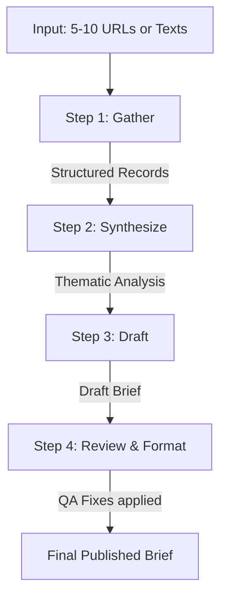

# FL-04 Automation Workflow

## Problem
Manually researching and writing a weekly industry brief is highly repetitive. Every week, a developer advocate or tech lead must open 10-15 tabs, read through industry news, extract the key points, find common threads, figure out what actually matters for developers, draft a newsletter, and format it. This mechanical process (read, summarize, synthesize, format) takes 2-3 hours of deep work, making it a perfect candidate for an AI automation workflow.

## Workflow diagram

## Tools used
- **Primary Engine:** Claude Project (Custom Instructions) / Custom GPT. 
- *Note on n8n:* While n8n is excellent for API-to-API automation, web scraping modern JS-heavy news sites often fails without premium integrations (like Firecrawl/Browserbase). Using a conversational AI interface where the user can paste text or rely on native LLM web search is significantly more robust and requires zero infrastructure for this specific workflow.
- **Format:** Markdown for all intermediate handoffs and final output.

## Step 1 — Gather
**Prompt/Configuration:**
> Take the provided list of articles/URLs/texts. For each, extract and normalize: Title, Source, Date, URL, and a 2-3 sentence main summary. Do not invent missing information.
**Handoff:** A structured Markdown list of source records.

## Step 2 — Synthesize
**Prompt/Configuration:**
> Analyze the gathered sources from Step 1. Identify: Major developments, recurring themes, important technical changes, disagreements between sources, and notable implications for developers. Every substantive claim must cite the source (e.g., [Source 1]).
**Handoff:** A structured synthesis document categorized by themes with source tags.

## Step 3 — Draft
**Prompt/Configuration:**
> Using only the synthesis from Step 2, draft a weekly brief containing: 1. Executive summary, 2. Top developments, 3. Why they matter, 4. Developer impact, 5. What to watch next. Maintain a professional, direct tone. Include source references.
**Handoff:** Draft weekly brief in Markdown.

## Step 4 — Review
**Prompt/Configuration:**
> Review the draft from Step 3. Check for: unsupported claims, hallucinated facts, duplicate points, unclear wording, missing source attribution, excessive speculation, and formatting problems. Apply fixes and output the FINAL formatted brief.
**Handoff:** Final ready-to-publish Markdown brief.

## Five runs
The five actual runs of this workflow on distinct input sets are fully documented in `fl04_automation_runs.md`.

## Timing
- **Manual estimated workflow time:** 120 - 180 minutes.
- **Automated workflow time (LLM execution):** ~3 - 5 minutes per run.
- **Setup time:** 45 minutes (designing prompts, creating the Project, testing constraints).
- **Recurring execution time (including human prep & review):** 15 - 20 minutes.
- *Honest assessment:* The setup cost was easily recuperated by the second run.

## Failure points
- **Inaccessible article:** Paywalls or anti-bot protections blocking URL reading (if providing URLs instead of pasting text).
- **Hallucinated synthesis:** The model occasionally connecting two unrelated technical updates into a false trend.
- **Missing citation:** The draft step sometimes drops specific source brackets `[Source X]` in favor of generic statements to sound more conversational.
- **Context window dilution:** If pasting 10 very long, unabridged articles, the model might lose track of nuanced details from the first article.

## Human review
Before publishing, a human MUST verify:
1. **Accuracy of technical claims:** Ensure no benchmark numbers, pricing, or technical specs were hallucinated.
2. **Tone check:** Remove any residual "AI speak" (e.g., "In conclusion," "It's important to note").
3. **Citation alignment:** Click through URLs to ensure the linked article actually supports the drafted claim.
